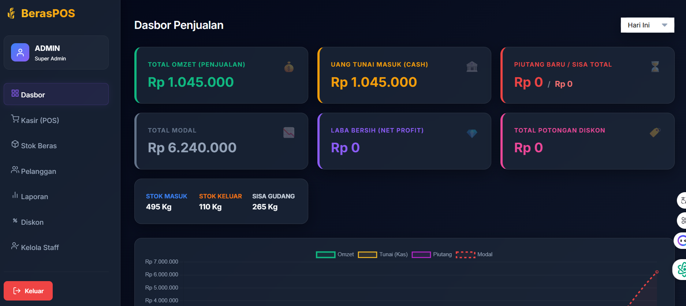

# 🌾 Rice-POS PRO: Enterprise Sales & Stock Management System

## 🚀 Overview
**Rice-POS PRO** adalah aplikasi web manajemen inventaris dan kasir (Point of Sale) modern yang dirancang khusus untuk distributor dan toko beras. Aplikasi ini menggabungkan estetika desain premium dengan logika bisnis yang kompleks untuk menangani transaksi harian, pengelolaan stok multifungsi (eceran vs karung), hingga pelacakan piutang pelanggan secara real-time.

Dibangun dengan filosofi **"Simple yet Powerful"**, sistem ini ideal untuk portofolio yang menunjukkan kemampuan integrasi Full-stack, desain UI/UX yang responsif, dan manajemen basis data yang efisien.

---

## 💎 Key Features

### 📊 1. Intelligent Financial Dashboard
*   **Real-time Analytics**: Pantau Omzet, Laba Bersih, dan Arus Kas secara langsung.
*   **Dynamic Charts**: Visualisasi tren penjualan harian, mingguan, hingga tahunan menggunakan Chart.js.
*   **Financial Sync**: Penghitungan laba bersih otomatis setelah dipotong nominal diskon dan modal (COGS).

### 🛒 2. POS (Point of Sale) with Custom logic
*   **Dual-Unit Pricing**: Mendukung penjualan per-Kilogram (Eceran) atau per-Sak (Karung) dengan konversi stok otomatis.
*   **Advanced Discount System**:
    *   **Auto-Member Discount**: Diskon khusus untuk pelanggan terdaftar.
    *   **General Discount**: Diskon untuk pelanggan umum (walk-in).
    *   **Special Override**: Input diskon manual (%) untuk kasus khusus.
*   **Multi-Payment Method**: Mendukung pembayaran Lunas (Tunai/Transfer) dan Piutang (Hutang).

### 📦 3. Advanced Inventory Management
*   **Stock Tracking**: Pantau sisa stok beras dalam kilogram.
*   **Variant Management**: Kelola berbagai ukuran sak (5kg, 10kg, 20kg, 25kg, 50kg) dalam satu produk tunggal.
*   **Stock In History**: Riwayat pengisian stok lengkap dengan harga beli (modal) untuk akurasi laporan laba.

### 👥 4. Customer & Debt Management
*   **Contact Management**: Simpan detail pelanggan dengan validasi nomor HP otomatis ( format 08xxx).
*   **Receivables Tracking**: Sistem pencatatan hutang otomatis. Setiap transaksi hutang akan menambah saldo piutang pelanggan.
*   **Payment History**: Detail riwayat pembayaran hutang beserta sisa saldo terakhir.

### 🔐 5. Role-Based Access Control (ACL)
*   **Super Admin**: Akses penuh ke semua fitur dan manajemen staff.
*   **Kasir**: Akses terbatas hanya untuk penjualan dan dashboard ringan.
*   **Gudang**: Fokus pada manajemen stok dan inventaris.
*   **Demo Role**: Akses *View-only* (khusus untuk showcase atau klien yang ingin mencoba).

---

## 🛠️ Technology Stack

| Component | Technology |
|-----------|------------|
| **Frontend** | HTML5, CSS3 (Vanilla), JavaScript (ES6+) |
| **Backend** | PHP 7.4+ (Native with PDO) |
| **Database** | MySQL / MariaDB |
| **UI Design** | Glassmorphism Aesthetics, Google Fonts (Inter) |
| **Charts** | Chart.js |
| **Icons** | Emojis & Font Awesome (Optional) |
| **Deployment** | Railway.app (Cloud Hosting) |

---

## ☁️ Database Architecture & Cloud Integration
Proyek ini dikonfigurasi secara cerdas untuk mendeteksi lingkungan jalannya aplikasi:
*   **Auto-Environment Sensing**: Secara otomatis beralih antara database lokal (XAMPP) dan Cloud (Railway) tanpa mengubah kode.
*   **Schema Auto-Repair**: Script backend yang mampu memperbaiki struktur tabel dan menambahkan kolom baru secara otomatis jika terjadi perubahan versi database.
*   **Data Integrity**: Menggunakan Transactional SQL untuk memastikan data stok dan keuangan selalu sinkron (Atomicity).

---

## 📸 System Walkthrough

> [!NOTE]
> *Ganti placeholder path di bawah dengan link screenshot asli hasil portofolio Anda.*

| Page | Description |
|------|-------------|
| **Dashboard** | Tampilan utama dengan kartu statistik keuangan dan grafik interaktif.  |
| **Inventory** | Daftar beras lengkap dengan sisa stok dan varian harga sak. |
| **POS Interface** | Keranjang belanja yang bersih dengan kalkulasi diskon otomatis. |
| **Customer List** | Manajemen data pelanggan dan rekap total piutang. |
| **Settings** | Pengaturan konfigurasi persentase diskon secara global. |

---

## 🏗️ How to Run Locally

1. Clone repository ini ke folder `htdocs` XAMPP Anda.
2. Buat database baru bernama `aplikasi_beras`.
3. Import file `database.sql` (jika ada) atau cukup jalankan aplikasi, sistem akan mencoba melakukan *auto-repair*.
4. Akses melalui browser: `http://localhost/aplikasi-beras`
5. Login default: 
   - User: `admin` | Pass: `admin` (Super Admin)
   - User: `gudang` | Pass: `gudang` (Gudang)
   - User: `kasir` | Pass: `kasir` (Kasir)

---

## 👨‍💻 Author
**[Nama Lengkap Anda]**
*   LinkedIn: [Link Anda]
*   Portfolio: [Link Portfolio]

---
*Created with ❤️ for better Enterprise management.*
